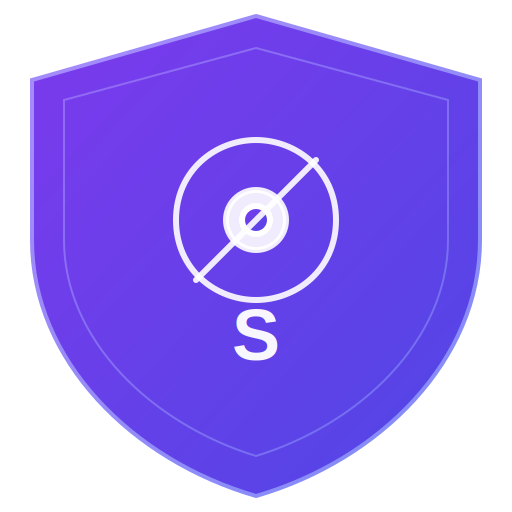

<p align="center">
  
</p>

<h1 align="center">Stealth Browser</h1>

<p align="center">
  A privacy-focused Chromium browser with integrated ad blocker, fingerprint protection, and zero data storage.
</p>

<p align="center">
  <a href="https://github.com/itriedcoding/StealthBrowser/releases"></a>
  <a href="https://github.com/itriedcoding/StealthBrowser/blob/main/LICENSE"></a>
  <a href="https://github.com/itriedcoding/StealthBrowser/actions"></a>
</p>

---

## Architecture

| Component | Technology | Description |
|-----------|-----------|-------------|
| Browser Engine | **C++** | Chromium-based core with process isolation |
| Security Features | **Rust** | Memory-safe ad blocker, crypto, fingerprint protection |
| UI Framework | **TypeScript** | React-based tab management, settings, navigation |
| Internal Pages | **HTML/CSS/JS** | New tab, settings, ad blocker dashboard |
| Build System | **GN + Ninja** | Chromium-compatible build with Rust integration |
| Automation | **Python** | Build scripts, linting, testing, setup |

## Features

### Integrated Ad Blocker
- 60+ pre-loaded tracker domains (Google Analytics, Facebook Pixel, Hotjar, etc.)
- Regex pattern matching for ad servers and tracking endpoints
- Keyword-based blocking for tracking parameters (utm_*, fbclid, gclid, etc.)
- Custom domain and pattern rules
- Separate Rust engine: [stealth-adblocker](https://github.com/itriedcoding/stealth-adblocker)

### Privacy Protection
- **Zero Data Storage** - All session data (cookies, cache, history, passwords) stored in-memory only
- **Auto-Cleanup** - Session data wiped on every browser close
- **Do Not Track** - DNT header sent with all requests
- **No Telemetry** - Zero data collection, no phone-home

### Fingerprint Protection
- **Canvas** - Noise injection into canvas fingerprinting
- **WebGL** - Spoofed vendor/renderer strings
- **AudioContext** - Subtle audio fingerprint perturbation
- **Screen** - Consistent spoofed resolution
- **Navigator** - Hardware concurrency, device memory, languages spoofed
- **Timezone** - UTC normalization

### Security Hardening
- **Content Security Policy** - Strict CSP headers on all responses
- **HTTPS Enforcement** - Automatic HTTP to HTTPS upgrade
- **XSS Protection** - X-XSS-Protection and X-Content-Type-Options headers
- **Permissions** - Camera, microphone, geolocation, notifications all denied
- **No Referrer** - Referrer-Policy set to no-referrer
- **HSTS** - Strict-Transport-Security with preload

## Installation

### Download

Download the latest release for your platform from [Releases](https://github.com/itriedcoding/StealthBrowser/releases).

### Windows

1. Download `StealthBrowser-Setup.exe` or `StealthBrowser-Portable.exe`
2. Run installer (or launch portable version)
3. Launch from Start Menu or Desktop

### macOS

1. Download `StealthBrowser.dmg`
2. Open DMG and drag to Applications
3. Launch from Applications (right-click > Open if Gatekeeper blocks)

### Linux

**AppImage:**
```bash
chmod +x StealthBrowser-*.AppImage
./StealthBrowser-*.AppImage
```

**Debian/Ubuntu:**
```bash
sudo dpkg -i StealthBrowser-*.deb
stealth-browser
```

**Fedora/RHEL:**
```bash
sudo rpm -i StealthBrowser-*.rpm
stealth-browser
```

## Build From Source

### Prerequisites

- Python 3.8+
- Rust 1.70+ (via [rustup](https://rustup.rs))
- Node.js 18+ and npm
- C++ compiler (Clang recommended)
- Ninja build system
- GN (Chromium build system)

### Quick Start

```bash
git clone --recurse-submodules https://github.com/itriedcoding/StealthBrowser.git
cd StealthBrowser

# Install all dependencies
python3 scripts/setup.py

# Build everything
python3 scripts/build.py --target release

# Run
./out/release/stealth-browser
```

### Manual Build

```bash
# Build Rust security module
cd src/security
cargo build --release

# Build TypeScript UI
cd ../ui
npm install
npm run build

# Build C++ engine with GN + Ninja
cd ../..
gn gen out/release --args='is_debug=false is_official_build=false stealth_use_rust=true'
ninja -C out/release //src:stealth_browser
```

### Build Commands

| Command | Description |
|---------|-------------|
| `python3 scripts/setup.py` | Install all dependencies and configure dev environment |
| `python3 scripts/build.py --target release` | Full release build |
| `python3 scripts/build.py --target debug` | Debug build with symbols |
| `python3 scripts/build.py --clean` | Clean build directories |
| `python3 scripts/build.py --package` | Package for distribution |
| `python3 scripts/lint.py` | Run linting on all source files |
| `python3 scripts/test.py` | Run test suite |

## Project Structure

```
StealthBrowser/
├── src/
│   ├── browser/          # C++ browser process
│   │   ├── main.cc       # Entry point
│   │   ├── browser_process.cc/.h
│   │   └── stealth.rc    # Windows resource file
│   ├── renderer/         # C++ renderer process
│   │   └── renderer_process.cc/.h
│   ├── security/         # Rust security module
│   │   ├── Cargo.toml
│   │   └── src/
│   │       ├── lib.rs
│   │       ├── crypto.rs     # AES-256-GCM encryption
│   │       ├── filter.rs     # URL filtering engine
│   │       ├── privacy.rs    # Privacy guard
│   │       └── ffi.rs        # C FFI bindings
│   └── ui/               # TypeScript UI
│       ├── package.json
│       ├── vite.config.ts
│       └── src/
│           ├── App.tsx
│           ├── main.tsx
│           ├── styles.css
│           ├── components/   # Settings, New Tab
│           ├── tabs/         # Tab management
│           └── navigation/   # URL bar, nav buttons
├── pages/                # Internal HTML/CSS/JS pages
│   ├── newtab/           # New tab page
│   ├── settings/         # Settings page
│   └── adblocker/        # Ad blocker dashboard
├── scripts/              # Python automation
│   ├── build.py          # Build system
│   ├── setup.py          # Dev environment setup
│   ├── lint.py           # Linting
│   └── test.py           # Test runner
├── build/                # GN build configuration
│   └── build.py          # Ninja build script
├── assets/               # Logo, icons
├── third_party/          # Dependencies (GN, Ninja)
├── BUILD.gn              # GN build file
├── .gclient              # Chromium deps config
└── .github/workflows/    # CI/CD
```

## Security Model

1. **Process Isolation** - Browser, renderer, and GPU processes run in separate sandboxes
2. **Memory Safety** - Security-critical code written in Rust (no buffer overflows, use-after-free)
3. **Zero Persistence** - All data lives in memory; wiped on exit
4. **Content Security** - Strict CSP prevents XSS and injection attacks
5. **Permission Denial** - All sensitive APIs (camera, mic, geo) denied by default
6. **Transport Security** - HSTS preload, HTTPS-only mode, no-referrer policy

## Ad Blocker

The ad blocker is maintained as a separate project: [stealth-adblocker](https://github.com/itriedcoding/stealth-adblocker)

```rust
// Rust ad blocker engine
use stealth_adblocker::FilterEngine;

let engine = FilterEngine::new();
assert!(engine.should_block("https://google-analytics.com/track"));
assert!(!engine.should_block("https://github.com/user/repo"));
```

## Contributing

1. Fork the repository
2. Create a feature branch (`git checkout -b feature/my-feature`)
3. Make your changes
4. Run tests (`python3 scripts/test.py`)
5. Run linter (`python3 scripts/lint.py`)
6. Commit (`git commit -m 'Add my feature'`)
7. Push (`git push origin feature/my-feature`)
8. Open a Pull Request

## License

MIT License. See [LICENSE](LICENSE) for details.

## Acknowledgments

- [Chromium](https://www.chromium.org/) - Browser engine
- [Rust](https://www.rust-lang.org/) - Memory-safe systems language
- [Electron](https://www.electronjs.com/) - Cross-platform desktop framework (reference architecture)
